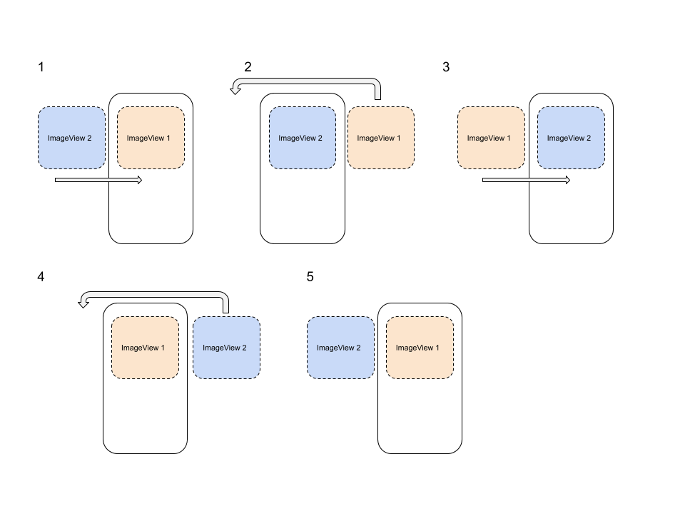

# Sweet Swipe

Sweet Swipe est une application android présentant à l'utilisateur un ensemble de profil avec une photo et une description. 
En double-cliquant sur une photo de profil l'utilisateur peut "liker" le profil.

## Animations

Toutes les transitions sont animées par des animations android customisées à partir de la classe *Animation*.  
L'application implémentant la détection des mouvements "swipe" pour afficher le profil suivant ou précédent: . 

Afficher ou masquer la description du profil:

La détection du double-clique afin de "liker" un profil:

## Swap buffer pour la transition entre les images de profil

L'effet de transition entre les photos de profil est réalisé via un swap buffer composé de deux ImageView.

